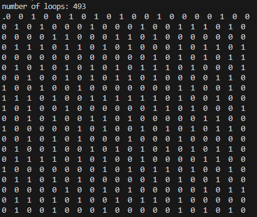
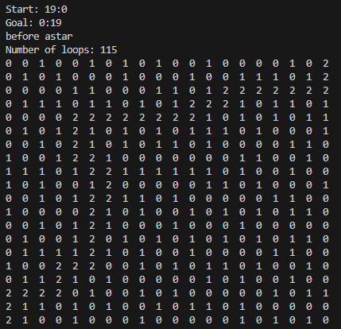
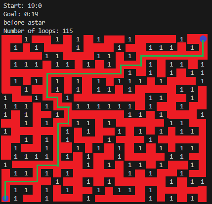

# Maze-Generator-in-C

## Overview:
Maze Generator in C is a simple program that uses a modified version of Prims algorithm to generate a maze with user spesified dimentions (width, height), and then uses the A-star algorithm to find the shortest path between a start and goal node.
 
Start node and goal node are set at the left side and right side of the maze resepctively.

## Output:
### Maze generation:
The kode generates a n*n grid based on user input (n), selects a random starting point in the grid and iteratively generates a maze with a modified version of Prims algorithm. Prims algorithm is originally used to generate minimum spanning trees in graph structures, but with added "randomness" can be used to generate maze structures. The first output to the console is the result of the maze generation.
 
0 --> Represents walkable paths, 1 --> represents walls:
 

### Pathfinding:
After maze generation, the program tries to set a start node and goal node on the left side and right side of the maze respectively, and finds shortest path with the A-star algorithm.
  
*Note* - that since the maze generation is done with an algorithm that creates minimum spanning trees, the A-star algorithm does not need to produce a lot of work since there are few choices of pathing at each step, which makes the heuristic very efficient.
 
0 --> Represents walkable paths, 1 --> represents walls, 2 --> represents chosen path with A-star from start to goal node:
 

#### Final product with a clear visual representation of maze and path:

 

### Running the project:
Project is created on Windows platform with the GCC compiler, and the .exe file has to be remade if user is on any other operating system with their respective C compilers. 
